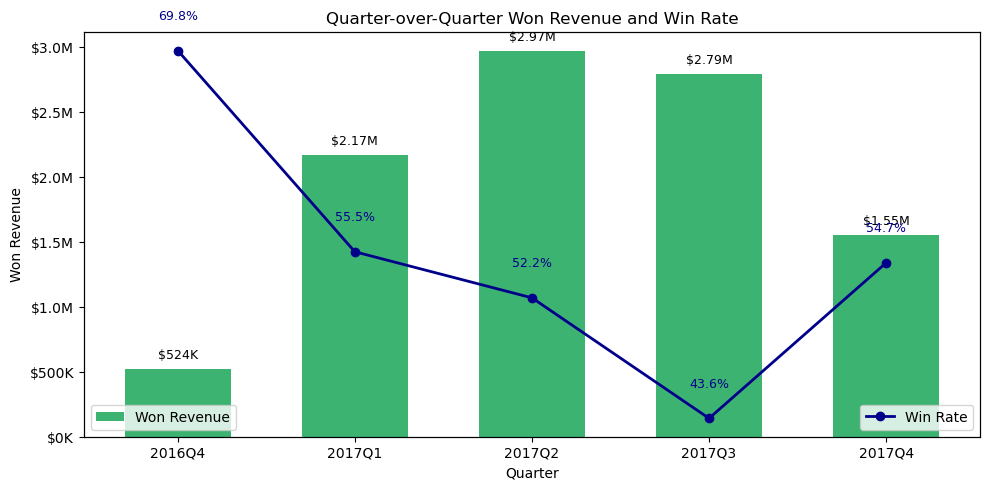

# CRM Sales Opportunities Analysis

This project analyzes the **CRM Sales Opportunities** dataset from Maven Analytics. The dataset represents B2B sales pipeline activity for a fictitious company that sells computer hardware.

**Tools:** Python · pandas · matplotlib · seaborn · Jupyter

---


## Dataset

Source page: https://mavenanalytics.io/data-playground/crm-sales-opportunities

Original source listed by Maven Analytics: data.world

License listed by Maven Analytics: Public Domain

The dataset contains multiple CSV files:

- `sales_pipeline.csv`: sales opportunities and deal outcomes
- `accounts.csv`: company/account information
- `products.csv`: product information and sales prices
- `sales_teams.csv`: sales agents, managers, and regional offices
- `data_dictionary.csv`: field descriptions

## Business Questions

This project focuses on the following questions:

1. How is each sales team performing compared to the rest?
2. Are any sales agents lagging behind?
3. Are there any quarter-over-quarter trends?
4. Do any products have better win rates?

## Key Findings

- **West region** leads in total revenue ($3.57M), but **East** has 
  the highest win rate (51.1%) — meaning East converts more efficiently.
- **Low-revenue agents** mostly win over 60% of their deals — their 
  issue is low pipeline volume, not poor closing skill.
- **Revenue grew** from $524K in 2016Q4 to $2.97M in 2017Q2 despite 
  a declining win rate — suggesting a shift toward higher-value deals.
- **GTK 500** is the only underperforming product at 37.5% win rate, 
  while all other products cluster between 46–50%.

  

## Setup

Before running the notebook, install the required Python packages.

From the project folder, run:

```bash
pip install -r requirements.txt
```

## Tools Used

- Python, Pandas, Matplotlib, Seaborn
- Jupyter Notebook
- Dataset: Maven Analytics (Public Domain)

## Run the analysis

Open `crm_sales_opportunities_cleaning.ipynb` in Jupyter Notebook or JupyterLab, then run all cells to reproduce the data cleaning, analysis, and visualizations.

## What this repo contains

- `crm_sales_opportunities_cleaning.ipynb`: the main analysis notebook
- `sales_pipeline.csv`, `accounts.csv`, `products.csv`, `sales_teams.csv`: source data files
- `data_dictionary.csv`: field descriptions
- `master_df_cleaned.csv`: cleaned master dataset

*Author: Zeinab BagheriFard*
